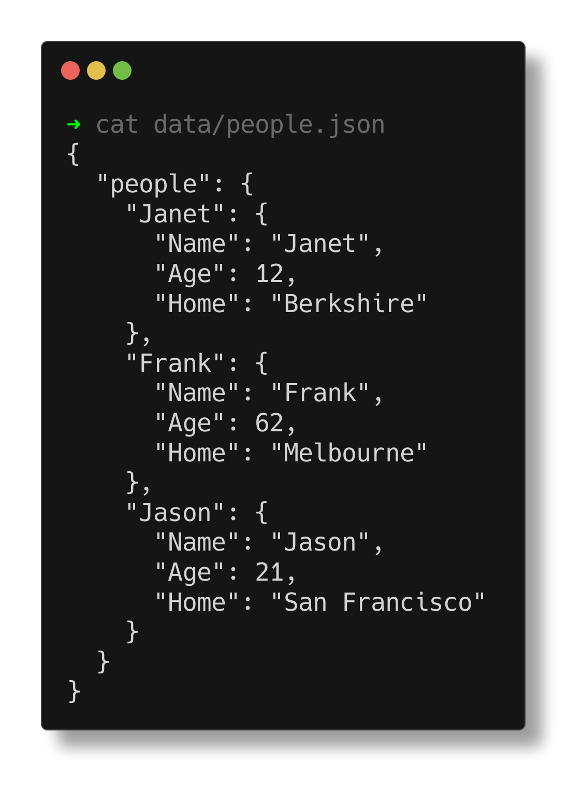

# File I/O

> file input/file output, json format or yaml format: Read in the supplied people.json or people.yaml file, print out the name and home for both people, add a third person and save to file.

\- Pdgeorge on the Comp Sci/IT server

I originally planned to do YAML support as well, but in the end I decided to keep it simple, and just write a nice JSON version.

## Notes
- macros macros macros i love macros. Nim has some really beautiful metaprogramming support, as powerful as Rust's, but far more user friendly. Combine that with user defined operators, and you get JSON literals as a library feature, without any special language support.
