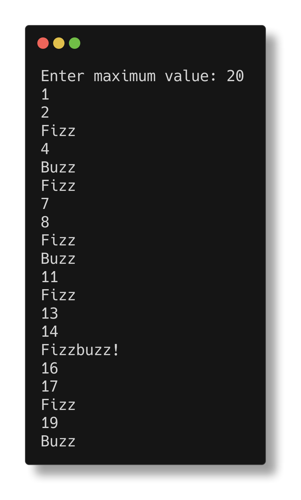

# Fizz Buzz

> fizzbuzz: (If you don't know what a FizzBuzz is, do a quick google, but in short, write a program that will automatically print numbers out "1, 2, etc." however any number that is a multiple of 3 print "fizz" any number that is a multiple of 5 print "buzz" any number that is a multiple of both 3 and 5 print "fizzbuzz")

\- Pdgeorge on the Comp Sci/IT server

Yeah, it's fizz buzz. Not much to say really.

## Notes
- Nim has an operator for conversions to string: `$`. That's a nice shorthand since explicit conversions are required.
- `echo` always adds a newline, so to avoid that, I had to use `stdout.write`
- Parentheses around arguments are optional - might lead to messy code? 
