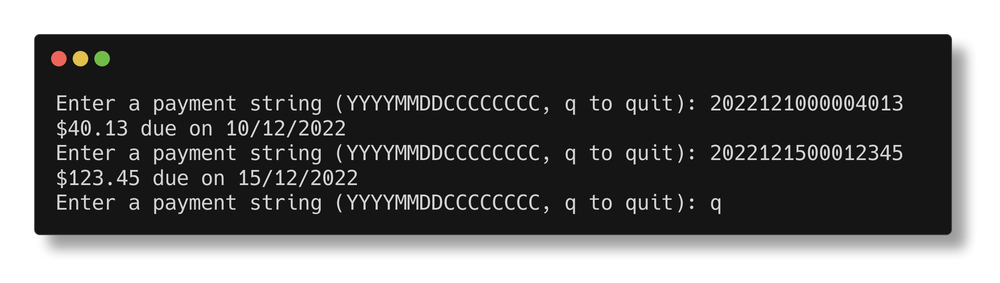

# Text Parsing

> text parsing: User inputs a string of a certain formatting, convert it to human readable formatting. Input information is the due date for payment alongside how much in cents. YYYYMMDDCCCCCCCC with "CCCCCCCC" having leading 0's. EG: 2022121000004013 -> $40.13 due on 10/12/2022

\- Pdgeorge on the Comp Sci/IT server

This is a pretty simple, well specified format, and can be parsed by simply chopping up a string. To give myself something further to learn, I've written the code using an intermediate type - the user input is parsed into a `Payment` type, which can then be converted to a string.

## Notes
- Operator overloading is handled quite neatly in Nim - simply escape the procedure name using backticks, and write it as any other procedure.
